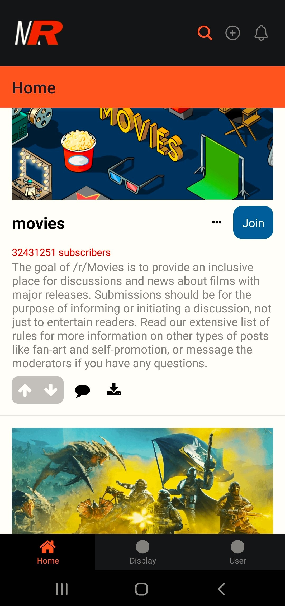
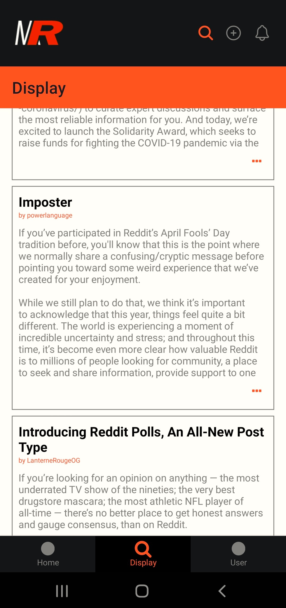
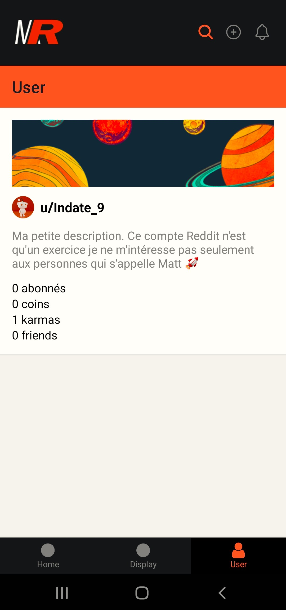

# Mobile Reddit

Mobile Reddit est une application mobile développée en utilisant React Native qui permet aux utilisateurs de naviguer avec Reddit depuis leurs appareils mobiles. Grâce à l'API de Reddit l'utilisateur peut se connecter à son propre compte et consulter les derniers subbreddits les plus populaire, les posts de ses abonnements, ainsi que consulter son profil.

## Fonctionnalités

- Navigation fluide: Utilisation de la navigation en onglets pour permettre aux utilisateurs de passer facilement entre différentes sections de l'application.

- Exploration de contenu: Accès aux dernières publications et discussions sur les sous-reddits favoris des utilisateurs.

- Authentification utilisateur: Possibilité de se connecter avec un compte Reddit existant, permettant aux utilisateurs d'accéder à leur contenu personnalisé et d'interagir avec la communauté.

## Technologies Utilisées

- React Native: Framework JavaScript pour le développement d'applications mobiles multiplateformes.

- React Navigation: Bibliothèque de navigation pour gérer la navigation entre les écrans et les onglets dans l'application.

- Reddit API: Utilisation de l'API Reddit pour récupérer et afficher les données des sous-reddits, des utilisateurs et des publications.

- AsyncStorage: API de stockage asynchrone pour stocker les données localement sur l'appareil de l'utilisateur.

## Installation

1. Cloner ce dépôt sur votre machine locale.
2. Naviguer dans le répertoire du projet.
3. Installer les dépendances en exécutant npm install.
4. Lancer l'application avec npx expo start --tunnel.
5. Utiliser un émulateur ou scanner le code QR avec l'application Expo Go sur votre appareil mobile pour voir l'application en action.

## Capture d'écran

    
    
    

